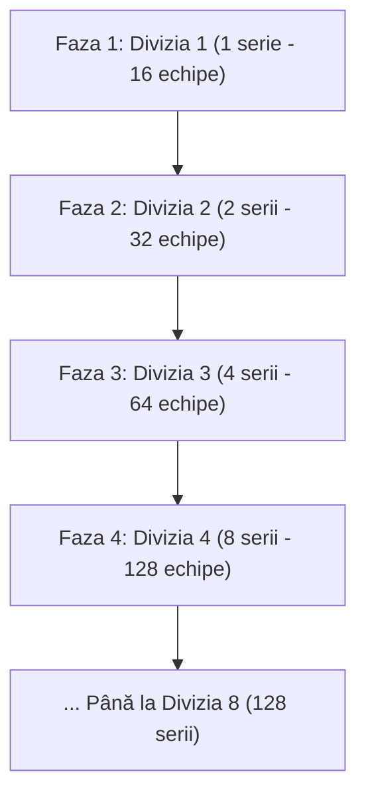

# Modelul de Creștere Organică a Diviziilor (Dynamic League Expansion)

În sistemul clasic din SoccerProject, toate cele 255 de ligi (4.080 de echipe) au fost generate de la început, ceea ce a dus la ligi pustii populate cu mii de boți generici.

Conform viziunii noastre, vom implementa un sistem mult mai inteligent și captivant: **Creșterea Dinamică a Piramidei de Sus în Jos**.

---

## 1. De ce este mult mai bună această abordare?

1. **Comunitate Vie de la Ziua 1**:
   * Dacă la lansare se înscriu primii 16-30 de manageri, ei vor juca **direct unii împotriva altora** în Divizia 1 (Divizia A), nu izolați prin ligi de boți uitate de lume.
   * Rivalitățile se nasc instantaneu: meciuri tari, chat activ, discuții despre tactică și bătălie directă pentru titlu!
2. **Eficiență Maximă de Server**:
   * Nu consumăm resurse simulând mii de meciuri inutile între boți la 04:00 dimineața. Serverul simulează exact meciurile utilizatorilor reali existenți.
3. **Senzația de Prestigiu pentru Primii Jucători (Founders Privilege)**:
   * Primii manageri care intră în joc sunt pionierii Diviziei 1. Ei luptă să se mențină în elită când valurile următoare de manageri încep să urce din ligile inferioare nou-create.

---

## 2. Fazele Extinderii Piramidei

Fiecare serie are exact **16 echipe**.

### Faza 1: Geneza (Sezonul 1)
* Se pornește **exclusiv cu Divizia 1** (1 serie de 16 echipe).
* Dacă la start sunt 12 manageri oameni, completăm doar cele 4 locuri rămase cu boți temporari.
* Toți oamenii joacă în aceeași ligă, se cunosc între ei și își testează primele echipe.

### Faza 2: Deschiderea Eșalonului 2 (Sezonul 2)
* Pe măsură ce se înscriu utilizatori noi peste limita de 16, sistemul activează automat **Divizia 2** (seriile `2.1` și `2.2` – 32 de locuri noi).
* La finalul Sezonului 1:
  * Ultimele echipe din Divizia 1 retrogradează în Divizia 2.
  * Noii veniți încep din Divizia 2 și se luptă pentru promovare în Divizia 1.

### Faza 3: Scalarea Automată (Diviziile 3, 4, 5...)
* Algoritmul backend verifică la finalul fiecărui sezon gradul de ocupare al ultimului eșalon activ:
  $$\text{Dacă Ocuparea Eșalonului Curent} > 75\% \implies \text{Activează Eșalonul Următor}$$
* Eșaloanele se dublează natural:
  * Eșalon 1 (Divizia A): 1 serie (16 echipe)
  * Eșalon 2 (Divizia B): 2 serii (32 echipe)
  * Eșalon 3 (Divizia C): 4 serii (64 echipe)
  * Eșalon 4 (Divizia D): 8 serii (128 echipe)
  * Eșalon 5 (Divizia E): 16 serii (256 echipe)
  * Eșalon 6 (Divizia F): 32 serii (512 echipe)
  * Eșalon 7 (Divizia G): 64 serii (1.024 echipe)
  * Eșalon 8 (Divizia H): 128 serii (2.048 echipe)

---

## 3. Algoritmul de Atribuire a Noilor Manageri

1. Când un utilizator nou se înregistrează:
   * Este plasat automat în **cel mai de jos eșalon activ la acel moment**.
   * Dacă există sloturi libere sau boți în acel eșalon, ia locul unui bot.
   * Dacă toate seriile din ultimul eșalon sunt ocupate de manageri umani activi în proporție de peste 90%, sistemul deblochează automat o nouă serie din eșalonul respectiv sau inițializează eșalonul inferior pentru noul sezon.

---

## 4. Concluzie Arhitecturală

Această decizie simplifică enorm lansarea inițială (MVP - Minimum Viable Product):
1. **La nivel de cod și teste**: Putem testa întregul ciclu de meciuri, clasamente, campionat și transferuri pe **o singură divizie de 16 echipe**!
2. **Imediat ce merge perfect pe o divizie**: Algoritmul de scalare multiplică seriile în mod dinamic în baza de date PostgreSQL fără nicio modificare la motorul de simulare.
