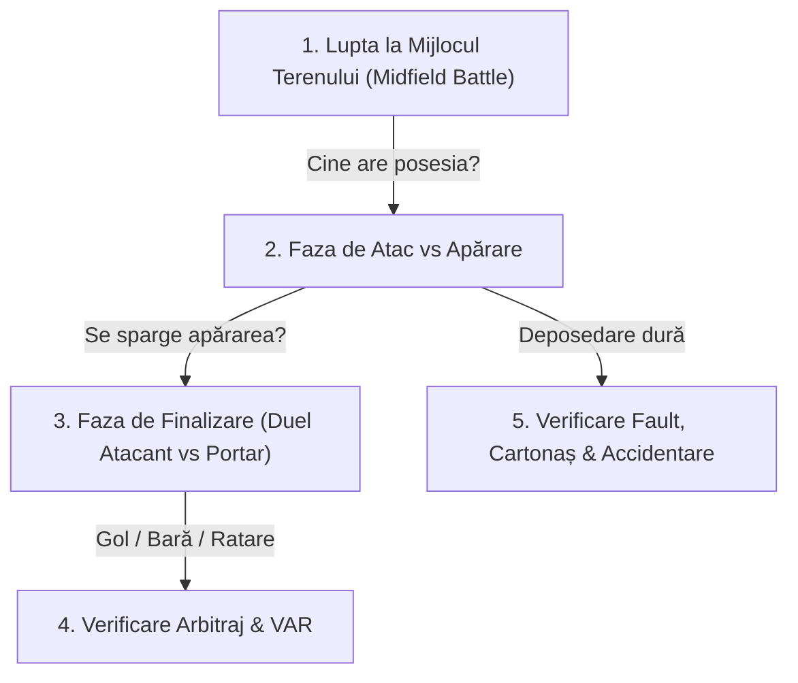

# Motorul de Simulare al Meciului & Matematica Factorului Aleatoriu (RNG)

Inima oricărui joc de tip football manager este **Motorul de Simulare (Match Engine)**. Un meci de fotbal nu este o ecuație matematică rigidă unde echipa cu rating mai mare câștigă de fiecare dată (altfel jocul ar fi plictisitor și previzibil ca un tabel Excel). 

În același timp, fotbalul nu este un joc de noroc (dacă ar fi doar zaruri, tactica și antrenamentele nu ar mai conta).

Acest document descrie arhitectura completă a **Motorului de Simulare Probabilistic**, rolul factorului aleatoriu (**RNG – Random Number Generator**), calculul șanselor de gol (**xG – Expected Goals**) și cum menținem jocul 100% corect și determinist.

---

## 1. Principiul de Bază: Determinism pe Bază de Seed (Anti-Cheat & Live Text Ticker)

Pentru a garanta că raportul de meci și cronica text sunt 100% corecte, identice la orice re-afișare și fără riscuri de trișare:
* Fiecare meci primește la fluierul de start un **Unique Match Seed**:
  $$\text{Match Seed} = \text{SHA256}(\text{MatchID} + \text{Data} + \text{HomeTeamID} + \text{AwayTeamID})$$
* Toate deciziile, fazele și evenimentele din cele 90 de minute provin dintr-un algoritm **PRNG pseudo-aleatoriu bazat pe acest seed**.
* *Rezultat*: Simularea generează un **Timeline de Evenimente & Comentariu Text Minut cu Minut** (Live Text Ticker). Dacă rulezi meciul de 1.000 de ori cu același seed, fazele descrise în text, marcatorii, cartonașele și accidentările vor avea loc la aceleași minute exacte!

---

## 2. Ponderile Notelor de Linie (Line Ratings)

Înainte de fluierul de start, motorul calculează ratingul efectiv al fiecărei linii:

### Factorii de Modificare ai Liniei:
1. **Calitatea Nativă a Jucătorilor**: Media atributelor specifice postului.
2. **Condiția Fizică (Fitness) & Rezistența (Stamina)**: Jucătorii obosiți își pierd până la 25% din randamentul liniei, cu penalizări severe pe final de meci dacă rezistența lor este mică.
3. **Moralul și Factorii de Viață (Life Factors/Hidden Events)**: "Beție, nopți nedormite, probleme de familie, gagicăreală". Aceste evenimente ascunse aplică modificatori (buffs/debuffs) temporari la moral și randament, afectând concentrarea pe teren.
4. **Experiența Căpitanului**: Căpitanul oferă un bonus între $+1\%$ și $+5\%$ pe toate cele 3 linii.
5. **Spiritul Echipei (Team Spirit)**: Multiplicator direct (o echipă cu 100% spirit joacă cu $+10\%$ mai bine decât una cu 50%).
6. **Instrucțiunile Individuale (`+`, `=`, `-`)**: Transferă puncte valorice între compartimente.
7. **Avantajul Terenului Propriu (Home Advantage)**:
   * Între $+2\%$ și $+6\%$, calculat dinamic în funcție de **starea gazonului** și **numărul de fani prezenți în tribune**.

Rezultă 6 note finale de linie:
* Gazde: $\text{Def}_H, \text{Mid}_H, \text{Att}_H$
* Oaspeți: $\text{Def}_A, \text{Mid}_A, \text{Att}_A$

---

## 3. Ciclul Minut cu Minut (The 90-Minute Simulation Loop)

Meciul este împărțit în **90 de minute (sau 15-20 de faze cheie de posesie)**. La fiecare fază, motorul trece prin următorul flux logic:

---

## 4. Matematica Factorului Aleatoriu (Distribuția Gauss / Clopotul lui Gauss)

Pentru a simula dramatismul din realitate (unde o echipă mai mică poate produce o "mare surpriză"):

### 1. Lupta pentru Posesie la Mijloc:
Probabilitatea ca echipa gazdă să câștige posesia într-o fază:
$$P(\text{Posesie}_H) = \frac{\text{Mid}_H}{\text{Mid}_H + \text{Mid}_A} + \text{RandomNoise}(-0.08, +0.08)$$
* Mijlocașii mai buni vor câștiga 65-75% din baloane, dar factorul aleatoriu oferă 25-35% din posesie echipei mai slabe pentru contraatacuri tăioase.

### 2. Crearea Șansei de Gol (xG - Expected Goal):
Când o echipă are posesia, linia sa de atac se duelează cu apărarea adversă:
$$\Delta_{\text{Duel}} = \text{Att}_H - \text{Def}_A + \text{RandomGaussian}(\mu=0, \sigma=10)$$
* Dacă $\Delta_{\text{Duel}} > 0$, se creează o **Ocazie Periculoasă de Gol**!
* Stilul tactic influențează direct: *Wing Play* creează centrări de pe benzi, *Passing Game* creează pase filtrante 1-la-1 prin centru.

### 3. Duelul Decisiv: Atacant vs. Portar
La fiecare ocazie periculoasă, atacantul șutează:
$$\text{Scor Șut} = \text{Calitate Șut} + \text{Intuiție} + \text{RNG}(1, 100)$$
$$\text{Scor Paradă} = \text{Reflexe Portar} + \text{Agilitate Portar} + \text{RNG}(1, 100)$$

* **Dacă Scor Șut > Scor Paradă + 15** $\implies$ **GOL Spectaculos!**
* **Dacă Scor Șut $\approx$ Scor Paradă** $\implies$ **Bară (Woodwork)** sau intervenție salvatoare a portarului!
* **Dacă Scor Paradă > Scor Șut** $\implies$ **Portarul prinde sau respinge în corner**.

---

## 5. Arbitrajul, Cartonașele & Suspansul VAR

### 1. Probabilitatea de Fault și Cartonașe:
La fiecare deposedare, se verifică agresivitatea jucătorului și strictețea arbitrului:
$$\text{Tensiune Fază} = \text{Agresivitate Jucător} + \text{Severitate Arbitru} + \text{RNG}(-15, +25)$$
* $\text{Tensiune} < 100$: Deposedare curată sau fault simplu, fără avertisment.
* $100 \le \text{Tensiune} < 130$: **Cartonaș Galben**.
* $\text{Tensiune} \ge 130$: **Cartonaș Roșu Direct** (intrare violentă cu talpa înainte)!

### 2. Protocolul Dramatic VAR (3% - 5% din meciuri):
La fazele limită de gol sau penalty:
* Motorul declanșează un eveniment `VAR_CHECK`:
  * În fluxul live text (Live Ticker), meciul se oprește scurt pentru suspans.
  * Pe ecran apare avertizarea de puls: *"🔍 Verificare VAR pentru posibil ofsaid / penalty..."*
  * În funcție de verificarea matematică a poziției: **Gol Anulat** sau **Gol Validat**. Acest moment creează o descărcare uriașă de dopamină și tensiune pentru utilizator!

---

## 6. Riscul de Accidentare (Fitness vs. Oboseală)

Accidentările nu sunt pur aleatorii; ele sunt o consecință a modului în care managerul își gestionează lotul:
$$\text{Risc Accidentare} = \text{Baza}(1\%) + \underbrace{\frac{100 - \text{Fitness}}{20}\%}_{\text{Penalizare Condiție Fizică}} + \underbrace{\frac{\text{Agresivitate Meci}}{50}\%}_{\text{Violență Meci}}$$

* **Exemplu**: Dacă forțezi un titular obosit cu **Fitness 65%** într-un derby violent cu 90% agresivitate, riscul lui de a suferi o ruptură musculară sau o entorsă crește de la 1% la **peste 6% per meci**!
* Acest calcul îl forțează pe manager să rotească lotul și să aibă rezerve de calitate.

---

## 7. Echilibrul "Marii Surprize" (The Underdog Effect)

Dacă Real Madrid joacă cu o echipă din Liga 3:
* În 85% din meciuri, Real Madrid câștigă la pas.
* În 10% din meciuri, este un egal chinuit.
* În 5% din meciuri, echipa mică dă lovitura pe contraatac (portarul lor prinde meciul vieții cu 10 parade miraculoase).

Acest interval controlat (85% / 10% / 5%) garantează că jocul este **competitiv și realist**: favoriții au un avantaj imens dacă își construiesc echipa corect, dar meciul nu este câștigat dinainte până nu se fluieră finalul!
